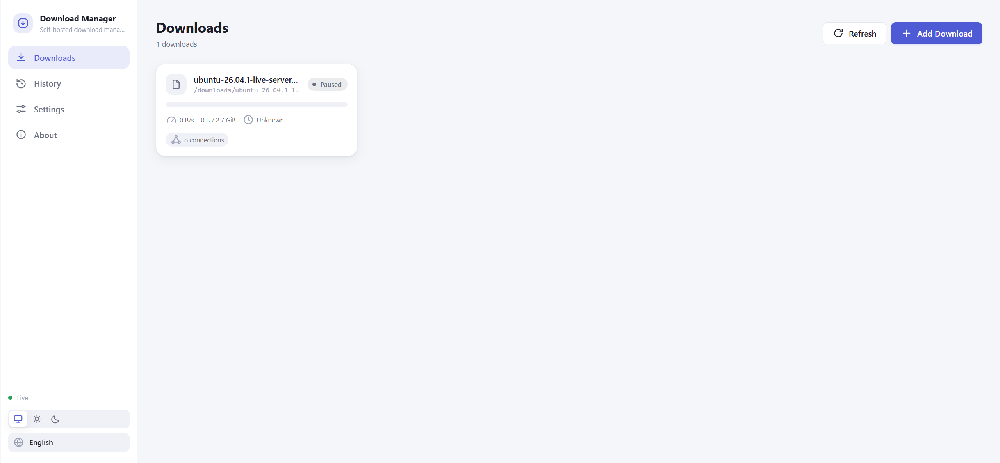
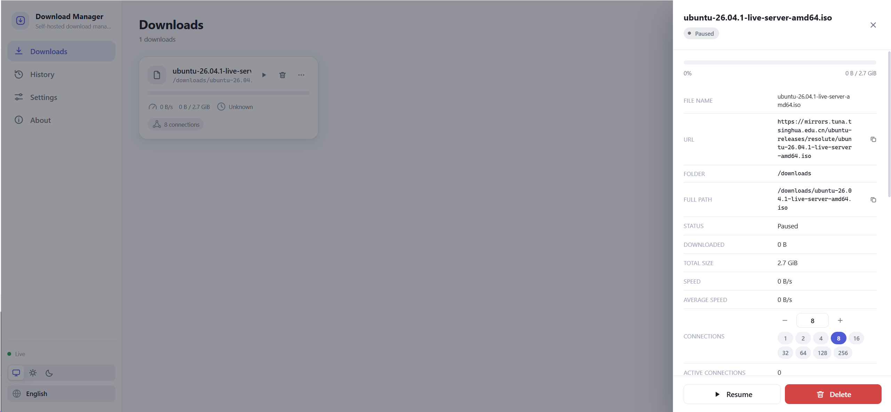
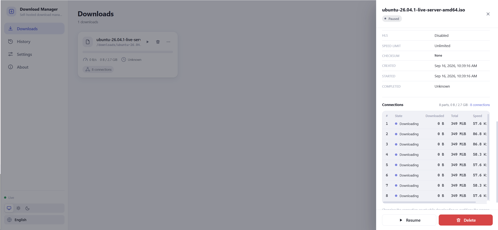
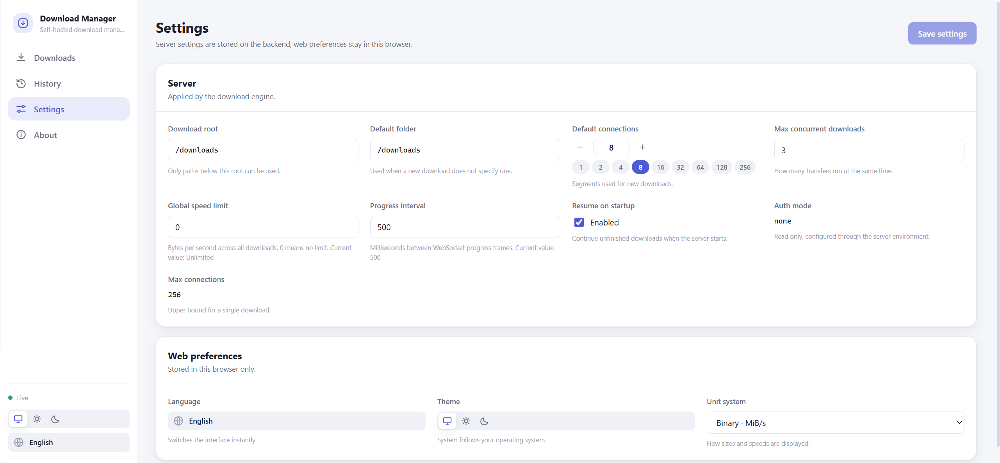

# abdm-server

[简体中文](README.md) | **English**

A self-hosted download manager: one JVM process that serves both the REST/WebSocket API
and a bundled web UI. It is built for LAN-first deployments and uses pinned AB Download
Manager v1.10.4 as its only download engine.

- Version: `1.0.2`
- Repository: <https://github.com/dixtdf/abdm-server>
- License: [Apache-2.0](LICENSE)
- Upstream engine: [AB Download Manager](https://github.com/amir1376/ab-download-manager)
  `v1.10.4` (git submodule, pinned commit — see [docs/upstream.md](docs/upstream.md))

---

## Features

- **Segmented downloads with 1–256 connections per task**: upstream ABDM owns
  part allocation, connection changes and resuming.
- **Queue and concurrency control**: `maxConcurrentDownloads` caps parallel downloads;
  the rest are queued and report their `queuePosition`.
- **Live progress over WebSocket** (`download.progress` / `download.state` / …) throttled
  by `progressIntervalMs`. The frontend never polls the REST API for progress.
- **Per connection parts view**: the same "connections / parts" table the ABDM desktop
  client shows (`#` / state / downloaded / total / speed), pushed as `download.parts`.
  Changing the connection count re-partitions the ranges without losing downloaded bytes
  or resetting the numbers.
- **Speed limits**: global `globalSpeedLimit` and per task `speedLimit`.
- **HLS, checksums, proxy, custom headers / cookies / referer / user-agent** per task.
- **Persistence**: ABDM stores download and part state; SQLite (WAL) stores server
  settings, queue order and API records. Unfinished tasks can resume after a restart.
- **Upstream engine**: downloads run on the pinned AB Download Manager runtime.
- **Bilingual UI**: `en-US` / `zh-CN`, with error codes separated from copy
  (see [docs/i18n.md](docs/i18n.md)).
- **Multi-arch images**: `linux/amd64` + `linux/arm64`.
- **Chrome download capture extension**: captures HTTP(S) downloads by default, with a toggle, login cookies, server IP/port/token settings and Chrome account sync ([setup](browser-extension/README.md)).

## Interface

<p align="center">
  A clean web console with live progress, segmented connection management, history,
  themes, and a bilingual interface.
</p>

<table>
  <tr>
    <td width="50%" align="center">
      <a href="docs/images/ui-en-downloads.png">
        
      </a>
      <br><sub><b>Downloads</b> · Monitor progress, speed, and connections live</sub>
    </td>
    <td width="50%" align="center">
      <a href="docs/images/ui-en-download-details.png">
        
      </a>
      <br><sub><b>Task details</b> · Paths, status, and connections at a glance</sub>
    </td>
  </tr>
  <tr>
    <td width="50%" align="center">
      <a href="docs/images/ui-en-connections.png">
        
      </a>
      <br><sub><b>Connections / parts</b> · Per-connection status and speed</sub>
    </td>
    <td width="50%" align="center">
      <a href="docs/images/ui-en-settings.png">
        
      </a>
      <br><sub><b>Settings</b> · Server configuration and web preferences in one place</sub>
    </td>
  </tr>
</table>

<p align="center"><sub>Click any image to view it at full size</sub></p>

---

## Quick start

### Option 1: Docker Compose (recommended)

1. Create `.env` in the repository root:

   ```dotenv
   IMAGE_OWNER=dixtdf        # or your own fork
   IMAGE_TAG=latest          # or edge / 1.0.2
   DOWNLOAD_HOST_PATH=/mnt/downloads
   AUTH_MODE=none            # or token
   AUTH_TOKEN=               # required when AUTH_MODE=token
   TZ=Asia/Shanghai
   PORT=6868
   ```

2. Prepare the directories once (the image runs as the non-root uid 1000, so
   **no `privileged` is needed**; the host directories must be writable by uid 1000):

   ```bash
   mkdir -p config
   sudo chown -R 1000:1000 config       # same for /downloads
   docker compose up -d
   docker compose logs -f downloader
   ```

   If the permissions are wrong the server refuses to start and prints that command.

3. Verify (the image ships the same health check):

   ```bash
   curl -fsS http://127.0.0.1:6868/api/v1/health
   # {"status":"ok","uptimeSeconds":3,"version":"1.0.2","engine":"abdm"}
   ```

4. Open `http://<LAN IP>:6868`.

To build the default image locally, first run
`git submodule update --init third_party/ab-download-manager` and
`bash scripts/build-abdm-bridge.sh`, then `docker build -t abdm-server:local .`. Point `image`
at `abdm-server:local` using the override shown in the comments at the top of
`docker-compose.yml`.

### Option 2: Local development (frontend and backend separately)

Requirements: JDK 17 and Node 22+. The default ABDM build also needs an Android SDK,
`git submodule update --init third_party/ab-download-manager`, and
`bash scripts/build-abdm-bridge.sh` before building the server. The export script
targets Java 17 without modifying upstream sources.

Backend (default `abdm` engine, port 6868):

```bash
# Linux / macOS
./gradlew :server:app:run

# Windows
.\gradlew.bat :server:app:run
```

Frontend dev server (Vite, port 5173, proxying to 6868):

```bash
cd web
npm ci
npm run dev
```

Build the single fat jar and run it directly:

```bash
./gradlew :server:app:shadowJar
java -jar server/app/build/libs/abdm-server-*-all.jar
```

When running locally you can relocate the directories with environment variables:

```bash
ABDM_CONFIG_DIR=./.local/config ABDM_DOWNLOAD_ROOT=./.local/downloads ./gradlew :server:app:run
```

---

## Configuration

### Environment variables

| Variable | Default | Description |
| --- | --- | --- |
| `PORT` | `6868` | HTTP/WebSocket port |
| `ABDM_CONFIG_DIR` | `/config` | SQLite database and runtime state (must be writable) |
| `ABDM_DOWNLOAD_ROOT` | `/downloads` | Download root; also the path-safety boundary (must be writable) |
| `ABDM_AUTH_MODE` | `none` | `none` or `token`; `none` prints a prominent warning at boot |
| `ABDM_AUTH_TOKEN` | empty | Required with `AUTH_MODE=token`. Every route except `/api/v1/health` needs `Authorization: Bearer <token>`; the WebSocket also accepts `?token=<token>` |
| `ABDM_WEB_DIR` | `/app/web` | Directory holding the built frontend; `/app/web` inside the image |
| `ABDM_LOG_LEVEL` | `info` | Log level (`debug` / `info` / `warn` / `error`) |
| `TZ` | `Asia/Shanghai` | Container timezone (logs and display only) |

`ABDM_ENGINE` is obsolete. The server ignores it in older Docker or `java -jar` configurations and always uses the upstream ABDM engine. Remove the variable from deployment settings when convenient.

Before upgrading an older native installation, back up `/config` and the download
directory. ABDM cannot directly resume the old task IDs and part state. The new
version refuses to start while those records remain; migrate or remove them first.

### Server settings

These are read and written through `GET/PUT /api/v1/settings` and stored in SQLite:

| Setting | Default | Description |
| --- | --- | --- |
| `downloadRoot` | `/downloads` | The only writable root; escaping it returns `PATH_OUTSIDE_DOWNLOAD_ROOT` |
| `defaultFolder` | `/downloads` | Target directory when a new task omits `folder` |
| `defaultConnections` | `8` | Connection count when a new task omits `connections` (1–256) |
| `maxConcurrentDownloads` | `3` | Parallel download limit; the rest wait in the queue |
| `globalSpeedLimit` | `0` | Global limit in bytes/second; `0` means unlimited |
| `resumeOnStartup` | `true` | Resume unfinished tasks at boot (otherwise they stay `PAUSED`) |
| `progressIntervalMs` | `500` | WebSocket progress throttle interval |
| `authMode` | `none` | Mirrors `ABDM_AUTH_MODE` |
| `maxConnections` | `256` | Hard upper bound for a task's connections |

UI language and theme are browser preferences (`ui.locale`, `ui.theme` in `localStorage`),
not server settings.

---

## API summary

The complete contract (endpoints, bodies, state machine, error codes, WebSocket frames)
lives in **[docs/api.md](docs/api.md)** and is the single source of truth followed by both
the frontend and `server:web-api`. Base path `/api/v1`; every error is
`{"error":{"code":"...","params":{...}}}` — the backend never returns localized sentences.

| Group | Endpoints |
| --- | --- |
| Health & version | `GET /health`, `GET /version` |
| Settings | `GET /settings`, `PUT /settings` |
| Directory browsing | `GET /directories?path=/downloads` |
| Tasks | `GET /downloads`, `POST /downloads`, `GET /downloads/{id}`, `DELETE /downloads/{id}?deleteFile=` |
| Task control | `POST /downloads/{id}/start`, `/pause`, `/resume`, `PATCH /downloads/{id}/connections` |
| History | `GET /history?limit=100`, `DELETE /history` |
| Live events | `WS /events` (the first `hello` frame carries every task, then incremental events) |

---

## Security model

This project targets **self-hosting on a LAN**, not public internet exposure.

- **`AUTH_MODE=none` by default**: anyone who can reach port 6868 can control downloads.
  The server prints a warning at boot. Unless the network is fully trusted, set
  `AUTH_MODE=token` together with a long random `ABDM_AUTH_TOKEN`.
- **Do not expose it directly to the internet.** For remote access use either:
  - a private network such as Tailscale / WireGuard (recommended, no open ports), or
  - a reverse proxy (Caddy / Nginx) providing TLS plus HTTP Basic auth or
    `AUTH_MODE=token`, bound to an internal address only.
- **Path safety**: every writable path is normalized by `PathGuard` and must stay inside
  `downloadRoot`; `../` traversal and absolute escapes return `PATH_OUTSIDE_DOWNLOAD_ROOT`.
  `/config` is never reachable through the API.
- **Least privilege container**: the image runs as the non-root user `abdm` (uid 1000),
  exposes only 6868, and ships no Node/npm/Gradle/source at runtime.
- **Single writer**: SQLite runs in WAL mode; the `/config` directory must belong to one
  service instance at a time.
- **Tokens never reach logs**: `ABDM_AUTH_TOKEN` is injected through the environment; do not
  commit it into `docker-compose.yml`.

---

## Repository layout

```
server/app          Ktor bootstrap, dependency wiring, static assets
server/web-api      REST + WebSocket routes and DTO mapping (contract in docs/api.md)
server/scheduler    Queue, concurrency, state machine, restart recovery
server/engine-api   Engine ports: DownloadEngine / EngineEvent / PathGuard / storage
server/engine-abdm   AB Download Manager adapter (the only download engine)
server/persistence  SQLite (WAL) storage
web/                Vue 3 + Vite frontend
third_party/ab-download-manager   Upstream submodule (read-only, never modified)
scripts/            update-abdm.sh / check-abdm.sh / build-release.sh
docs/               api.md / architecture.md / i18n.md / upstream.md
```

Layering, the threading/coroutine model and the restart-recovery flow are described in
[docs/architecture.md](docs/architecture.md).

---

## Upstream engine and submodule

- Pinned to `AB Download Manager v1.10.4`, commit
  `afc57634b3c121c6415213242b2b600cccc6fd6e`.
- Every build compiles against the pinned upstream
  runtime jars exported to `third_party/abdm-dist/` by `scripts/build-abdm-bridge.sh`.
  The export needs an Android SDK and targets Java 17.
- `third_party/ab-download-manager` is **never modified**; all adaptation lives in
  `server/engine-abdm/`.
- Upgrade procedure and the compatibility checklist: [docs/upstream.md](docs/upstream.md).

Scripts (Bash with `set -euo pipefail`; make them executable first, and run them through
Git Bash or WSL on Windows):

```bash
chmod +x scripts/*.sh          # Linux / macOS / Git Bash

scripts/check-abdm.sh          # verify the submodule is clean and at the pinned commit
scripts/update-abdm.sh v1.10.5 # move the pin, printing old -> new commit
scripts/build-abdm-bridge.sh   # export the upstream runtime jars into third_party/abdm-dist
scripts/build-release.sh       # build frontend + fat jar, write dist/SHA256SUMS
```

---

## Build and verification (also what CI runs)

Backend:

```bash
git submodule update --init third_party/ab-download-manager              # pinned v1.10.4
bash scripts/build-abdm-bridge.sh                                        # export Java 17 runtime
./gradlew build                                                         # ABDM build + compatibility tests
./gradlew :server:engine-abdm:test                                       # AbdmCompatibilityTest
./gradlew --no-daemon :server:app:shadowJar                              # build the fat jar
```

Frontend (inside `web/`):

```bash
npm ci
npm run i18n:check     # copy and error-code completeness gate
npm run lint
npm run typecheck
npm run test
npm run build          # writes web/dist
```

Container:

```bash
docker build -t abdm-server:local .
docker run --rm -p 6868:6868 -v "$PWD/config:/config" -v /mnt/downloads:/downloads abdm-server:local
curl -fsS http://127.0.0.1:6868/api/v1/health
```

CI is just `.github/workflows/release-manual.yml`: type a version and it verifies,
builds, pushes the multi-arch image, tags and creates the release (a failure never
leaves a tag behind). Run the same checks locally with `./gradlew build` and, in `web/`,
`npm run i18n:check && npm run lint && npm run typecheck && npm run test`.

### Local end-to-end acceptance

The repository ships a repeatable acceptance script that covers the core items of the V1
checklist: segmented download, **changing the connection count mid-download**
(8 → 64 → 256 → 16), pause → process restart → resume, and identical results with
1 / 64 / 256 connections — every step verified by SHA-256.

```bash
# 1) start a Range-capable local file server (--throttle slows it down for observation)
node scripts/test-http-server.mjs ./big.bin 9100 --throttle 262144

# 2) start the service (port 6868 by default)
./gradlew :server:app:fatJar
java -jar server/app/build/libs/abdm-server-*-all.jar

# 3) run the full acceptance suite (Windows PowerShell; it starts its own servers)
powershell -ExecutionPolicy Bypass -File scripts/acceptance-test.ps1 -FileSizeMb 256
```

`AbdmCompatibilityTest` uses a local Range server and the real ABDM engine to
verify downloads, pause, restart recovery, and connection handling.

---

## Releasing

Releases are cut by a **manual GitHub Actions workflow**
(`.github/workflows/release-manual.yml`): type a version, and it tags the chosen ref
(`main` by default), publishes the image to GHCR and attaches the binaries to a GitHub
Release.

1. Actions → **Release (manual)** → Run workflow
2. Fill in the inputs:

| Input | Required | Default | Meaning |
| --- | --- | --- | --- |
| `version` | yes | – | Semantic version such as `1.0.2` (a leading `v` is accepted) |
| `ref` | yes | `main` | Branch, tag or commit to build and tag |
| `prerelease` | no | `false` | Mark the GitHub Release as a pre-release |
| `push_latest` | no | `true` | Also move the `:latest` image tag |
| `dry_run` | no | `false` | Verify and build only: no image push, no tag, no release |

3. The job then: validates the version and refuses an existing tag → checks out `ref`
   (with submodules) → runs the backend `build`, frontend gates and Chrome extension tests
   → builds the versioned fat jar (verified with `java -jar server.jar --print-version`)
   → packages the extension ZIP and signed CRX3 and writes `SHA256SUMS` → pushes the multi-arch image
   (`linux/amd64` + `linux/arm64`) → creates the tag and GitHub Release with
   `server.jar`, `docker-compose.yml`, `abdm-server-chrome-extension-<version>.zip/.crx` and
   `SHA256SUMS` attached. Before a manual release, set the Actions secret
   `CHROME_EXTENSION_KEY_B64` to the Base64-encoded PEM private key matching the extension's `manifest.key`.

Produced artifacts:

```text
ghcr.io/dixtdf/abdm-server:1.0.2     # version
ghcr.io/dixtdf/abdm-server:0.2       # major.minor
ghcr.io/dixtdf/abdm-server:latest    # when push_latest=true
tag: v1.0.2 (on the commit ref points at)
```

Two notes:

1. The tag is created **last**, so a failed verification or image build never leaves a tag
   behind.
2. This workflow owns both the image and the release; there is no "release on tag push"
   workflow any more, so pushing a tag by hand only creates a tag - no image, no
   release. A tag pushed with `GITHUB_TOKEN` does not trigger other workflows, which is
   why this workflow also creates the release itself.

To reproduce the version stamping locally:

```bash
./gradlew -Pproject.version=1.0.2 :server:app:fatJar
java -jar server/app/build/libs/abdm-server-*-all.jar --print-version   # -> 1.0.2
```

Bump the version (one command updates the Gradle catalog, the frontend
`package.json`/`package-lock.json`, the server and engine fallbacks and both
READMEs; everything else derives from those):

```powershell
# show what would change, write nothing
powershell -ExecutionPolicy Bypass -File scripts/set-version.ps1 1.0.2 -DryRun

# apply, optionally commit / tag / push
powershell -ExecutionPolicy Bypass -File scripts/set-version.ps1 v1.0.2 -Commit -Tag
```

---

## Acknowledgements

Special thanks to **AB Download Manager (ABDM) and all of its contributors**. This
project's download core, its part (segment) model and the interaction of the
"connections / parts" view all build on their work, and `engine-abdm` reuses their runtime
directly — without ABDM this project would not exist. Thanks as well to the Kotlin, Ktor,
SQLite JDBC, Vue and Vite communities.

---

## License

[Apache License 2.0](LICENSE). Third-party components and the upstream engine are
attributed in [THIRD_PARTY_NOTICES.md](THIRD_PARTY_NOTICES.md).

**This project is not affiliated with or endorsed by AB Download Manager.**
